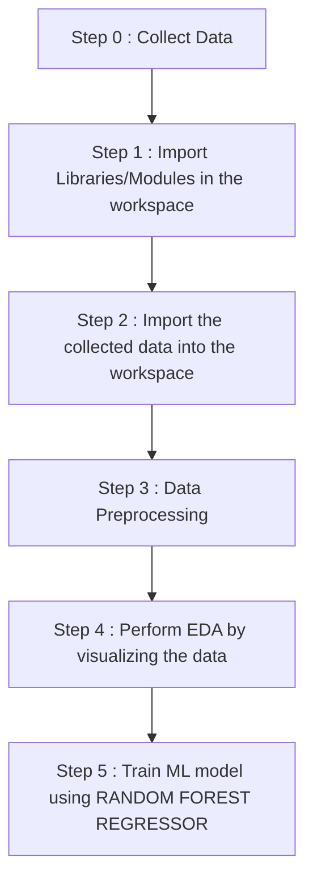

# Gold-Price-Prediction-using-Python
This is a Gold Price Predictor where it predicts the price of gold on the basis of different data like Date, Silver etc. 

Dataset Link : https://www.kaggle.com/datasets/altruistdelhite04/gold-price-data

<h1 align='center'> WORKFLOW OF THE PROJECT<br></h1>


  
  
<ol>
  <li><b><i>DATA COLLECTION</i></b> - The SONAR data used in the above project is collected from kaggle. <br>Link : https://tinyurl.com/ybm7fpwp<br>
  <li><b><i>SETTING UP WORKSPACE/ENVIRONMENT</i></b> - This basically means importing of all the required modules and importing the data.<br>
  Modules used in this project : 
  
  ```
    import numpy as np
    import pandas as pd
    from sklearn.model_selection import train_test_split
    from sklearn.metrics import accuracy_score
    from sklearn.linear_model import LogisticRegression
  ```
    
  
